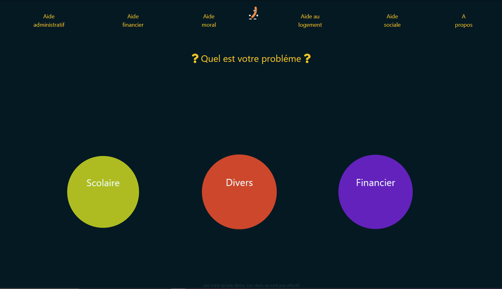
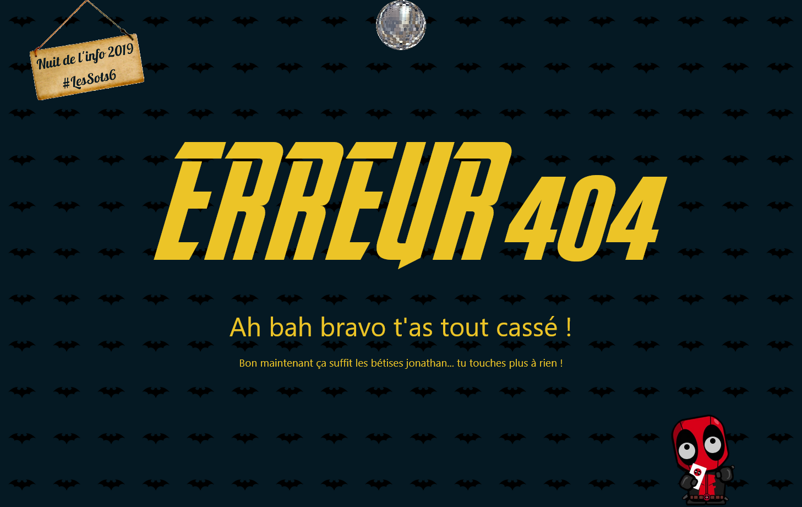
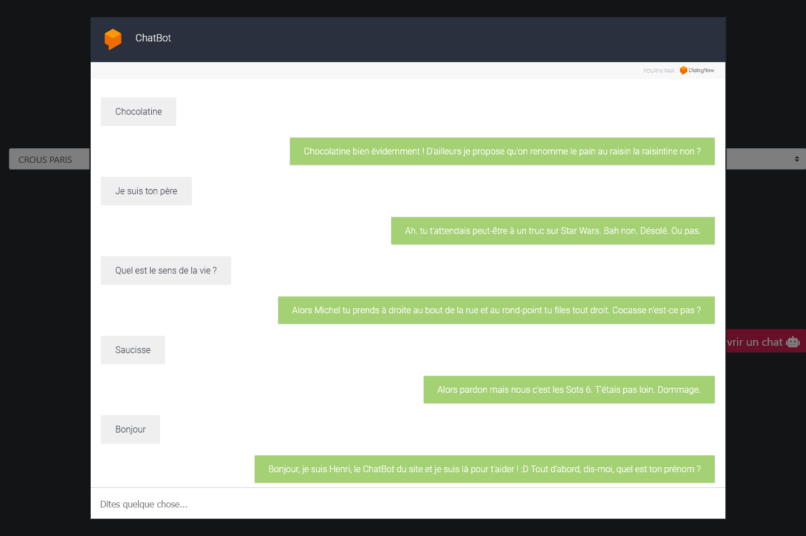
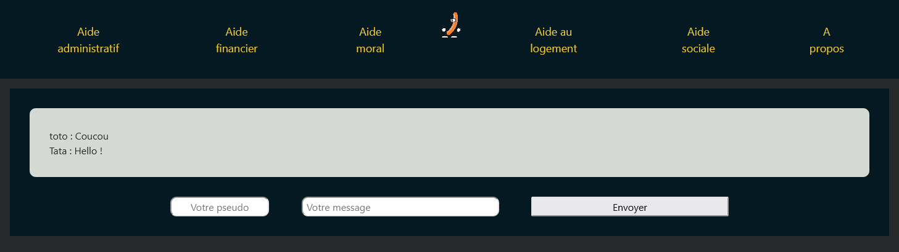

# Les-Sots-6
Equipe de la nuit de l'info 2019

### Thème : "Augmenter le pouvoir d’agir des étudiants/es en situation de précarité"
Pour plus de détails: [nuit_de_linfo.pdf](nuit_de_linfo.pdf)

### Prix :

| 3ème/138 équipes au défi d'Ubisoft :   "GIF US SOME LOVE !" |
| --- |
|  |

## Images:

| Accueil - quiz interactif |
| --- |
|  |

| | Error 404 | |
| --- | --- | --- |
|  |  |  |

| | | Aides | | |
| :-: | :-: | :-: | :-: | :-: |
| Aide Administrative | Aide Financière | Aide Morale | Aide Logement | Aide Sociale |
|  |  |  |  |  |

| ChatBot |
| --- |
|  |

| Chat avec les autres utilisateurs |
| --- |
|  |
